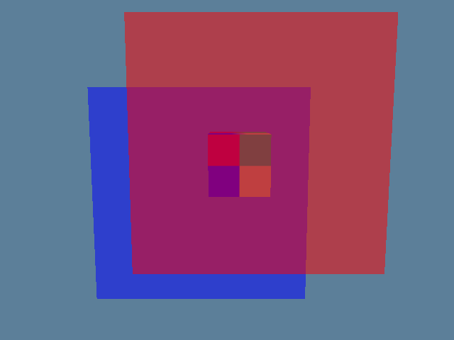

# MiniStudio v0.2 验证与交接

日期：2026-09-10。第 52 课按学习者要求由助手直接完成版本整理与集成验证，跳过学习者复盘问答及实际投入调查；不把课程编号当作已经投入 13 周的证据。

## 当前版本

`CMakeLists.txt` 与 `vcpkg.json` 的版本均为 **0.2.0**。默认画面是一个旋转的纹理立方体和两个红、蓝半透明平面，支持 W/A/S/D 移动、左键捕获鼠标并转头、右键释放、窗口 resize 和 Esc 退出。



演示由真实 Renderer 输出的 90 帧 GPU 读回数据编码，按 15 fps 播放约 6 秒；相机沿预设轨迹环绕场景。这是确定性绘制演示，不代表鼠标输入的录屏或额外的交互验收。

第 49 课的 Alpha 裁剪画面保存在历史提交 `bfbb200`；当前默认演示为两层混合。回归程序通过单独的受控 Shader 检查 alpha 为零与 `discard` 的颜色、深度差异。

## 一帧与所有权

```text
main → Application
         ├─ GlfwWindow → GLFW、Window、Current OpenGL Context
         ├─ Camera → 位置、yaw/pitch、forward/right、view（CPU）
         └─ Renderer
              ├─ ShaderProgram → GPU Program
              ├─ cube VertexArray / Texture2D
              ├─ translucent VertexArray / Texture2D（两个绘制项共享）
              ├─ ImageLoader → stb_image、ImageData（初始化期间）
              └─ RenderCommand → 无状态的 OpenGL 命令
```

主线程先处理事件和输入，以帧间秒数更新 Camera，随后把 view、累计秒数及 framebuffer 尺寸传给 Renderer。Renderer 清颜色和深度，画不透明立方体，再计算两个平面中心的相机空间 z，排序整个 CPU 绘制项并按远到近绘制，最后恢复状态并返回。窗口负责交换前后缓冲。

| 阶段 | 深度测试 | 深度写入 | 混合 | 剔除 |
| --- | --- | --- | --- | --- |
| 帧首、清屏及不透明立方体 | 开启，LESS | 开启 | 关闭 | Back，CCW 为正面 |
| 两层透明 | 保持开启 | 关闭 | SRC_ALPHA / ONE_MINUS_SRC_ALPHA | 关闭，允许双面 |
| 透明阶段退出（含 uniform 失败） | 保持开启 | 恢复开启 | 关闭 | 恢复开启 |

窗口持有默认 framebuffer 的存储。Renderer 按值拥有 Program、两个 VertexArray 和两个 Texture2D，资源类禁止复制、支持移动；VertexArray 同时管理 VAO、VBO、EBO。每帧的绘制数组只保存 model、tint 和 view_z，可以复制和排序，不拥有 GPU 对象。初始化的图片字节、顶点与索引上传后无需继续存活；uniform 调用复制矩阵或向量值。

Application 成员为 `window_ → renderer_ → camera_`，按逆序销毁：先销毁纯 CPU Camera，再销毁 Renderer 内的纹理、顶点资源及 Program，最后销毁窗口和 Context。所有 GLFW/OpenGL 调用及 GPU 资源释放都在主线程。

本课把透明阶段收进 Renderer 的私有方法，把模型构造和 CPU 列表生成限制在实现文件的匿名命名空间；移除未使用的单平面 model 函数。没有新增场景系统、Material、RenderDevice 或资源所有者。

## 可复现检查

回归目标 `ministudio_regression` 默认关闭，显式配置 `MINISTUDIO_BUILD_TESTS=ON` 才构建。它复用实际 Renderer、Camera 和资源模块，通过 GLFW 创建 OpenGL 4.1 Context 并隐藏测试窗口，需要可用的图形桌面和驱动，不是纯 headless CI 测试。

macOS（保持 Homebrew GLFW/GLM 与系统 OpenGL 路径）：

```bash
cmake -S . -B build/v02-macos-debug \
  -DCMAKE_BUILD_TYPE=Debug -DMINISTUDIO_BUILD_TESTS=ON
cmake --build build/v02-macos-debug --parallel
ctest --test-dir build/v02-macos-debug --output-on-failure
```

Windows（在已加载 VS x64 开发环境的终端执行；`VCPKG_ROOT` 指向已安装的 vcpkg）：

```powershell
cmake -S . -B build/v02-windows-debug -G Ninja `
  -DCMAKE_BUILD_TYPE=Debug -DMINISTUDIO_BUILD_TESTS=ON `
  -DCMAKE_TOOLCHAIN_FILE="$env:VCPKG_ROOT/scripts/buildsystems/vcpkg.cmake"
cmake --build build/v02-windows-debug --parallel
ctest --test-dir build/v02-windows-debug --output-on-failure
```

Release 使用独立目录，并把 `CMAKE_BUILD_TYPE` 设为 `Release`。若 CMake/Ninja 不在 PATH 中，可使用 IDE 自带工具的完整路径。不同平台的构建目录和依赖安装目录必须分开。

回归输出包含：

- Camera 的位移、view、yaw、pitch 限制和正交归一化方向。
- 真实 vec4 uniform 读回、缺失 uniform 失败路径、资源移动和析构后的 GPU 句柄失效。
- PNG 加载，以及文件缺失时不破坏原有 ImageData；此负向用例会明确打印一条预期的缺失文件诊断。
- Alpha 零但不裁剪时仍写颜色与深度；使用 `discard` 后孔内不写颜色和深度，实心区正常写入。
- 从相机正面和背面检查背景、红色独占区、蓝色独占区、两层重叠区；参考颜色按每条像素射线实际命中平面的距离计算，而非复制 Renderer 的中心排序逻辑。
- 旋转立方体的深度与动画变化、透明区域不写深度、固定时间重复帧一致、零尺寸帧跳过、状态被扰动后恢复。
- 实际窗口 resize 后 viewport 与 framebuffer 尺寸一致，横竖比例下颜色和深度仍正确。
- RequestClose/ShouldClose 路径及 Context 存活期间的资源释放。

可选导出同一 Renderer 的演示帧：

```powershell
./build/v02-windows-debug/ministudio_regression.exe --capture-dir build/v02-capture
```

运行目录需能访问 `assets/`，从仓库根或可执行文件目录运行均可。导出为 90 张 PPM；此次 GIF 使用助手环境已有的 Pillow 编码，未给项目新增依赖。GPU 数值验证使用原始读回值，GIF 的调色板压缩不参与验收。

## 实际证据与限制

| 项目 | 家用 Windows：本轮实际结果 | 公司 macOS：本轮情况 |
| --- | --- | --- |
| 配置和编译 | MSVC 19.51、全新 Debug / Release 目录均成功，未输出编译器警告 | 未执行；平台分支仍使用系统 OpenGL |
| CTest | Debug、Release 均 1/1 通过，测试进程正常返回 0 | 未执行 |
| 默认构建 | 独立目录未传测试选项，确认 `MINISTUDIO_BUILD_TESTS=OFF`，配置编译成功 | 未执行 |
| GPU 采样 | 正反视角与三种尺寸合计 7728 个采样点；非立方体颜色允许 2/255 量化误差，立方体检查投影深度 | 未执行 |
| 错误检测 | 暂把 `<` 改成 `>` 后，在像素 `(137,111)` 检测到红通道 87、期望约 150.77；恢复后通过 | 未执行 |
| 录制 | 640×480、90 帧，检查正反面预览；输出约 473 KiB GIF | 未执行 |
| 交互 | 第 51 课学习者已确认移动相机、转向及混合结果；本轮自动化只验证值接口、resize 和关闭标志 | 第 48～49 课有历史人工交互记录，不能算作 v0.2 回归 |
| Sanitizer | 未执行；当前 MSVC 构建不启用项目的 Clang/GNU ASan/UBSan 选项 | 未执行 |

本次新目录为 `build/lesson-52-windows-debug`、`build/lesson-52-windows-release` 与 `build/lesson-52-windows-default`。它们复用第 50 课已有的 Windows vcpkg 安装目录，并以 `VCPKG_MANIFEST_INSTALL=OFF` 配置，未新增或更新依赖。

物体中心排序只覆盖当前受控场景；三维穿插、循环遮挡和某些斜视的局部遮挡不能由单一物体级顺序保证正确。GIF 环绕中的接近侧视角不作为任意透明几何正确性的证明。默认 framebuffer、非预乘 alpha 和单线程模型继续保留。

## 下一步

第 52 课完成的是助手代为实现的工程收尾与 Windows 验证。学习者的个人投入和季度问答按明确要求跳过；不补写虚构工时，也不新增学习者尚未展示的能力结论。下一项为 B01（第 53 课）CPU MeshData 与顶点布局，尚未开课；本轮不提前实现模型加载、光照或其他未来模块。
